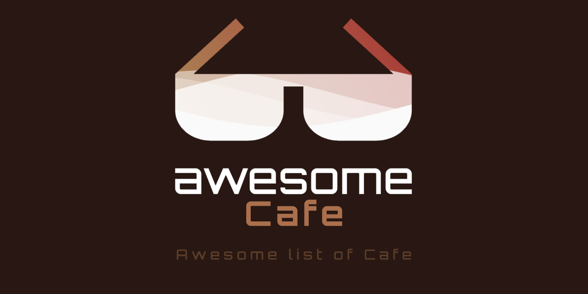

<h1 align="center">Awesome Cafe</h1>

Cafe list for developers

   

## Contents

- [Awesome Cafe - US](./README-us.md)
- [Awesome Cafe - CA](./README-ca.md)
- [Awesome Cafe - KR](./README-kr.md)
- [Awesome Cafe - JP](./README-jp.md)

The target countries will be added gradually.
Contributions through [Pull Requests](https://github.com/KennethanCeyer/awesome-cafe/pulls) are always welcome!
